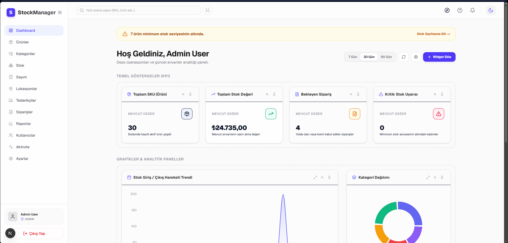
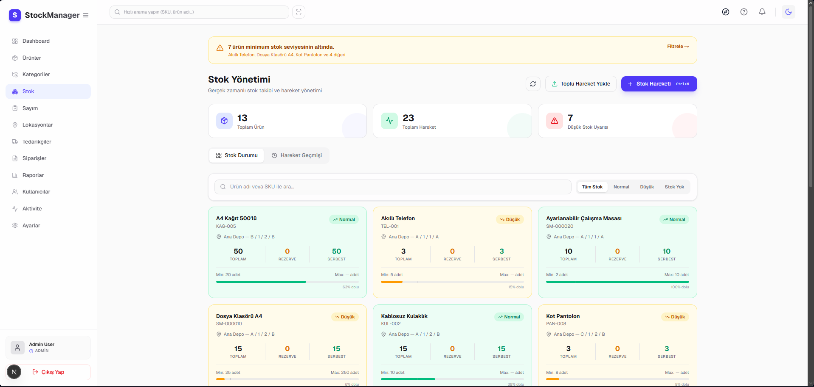
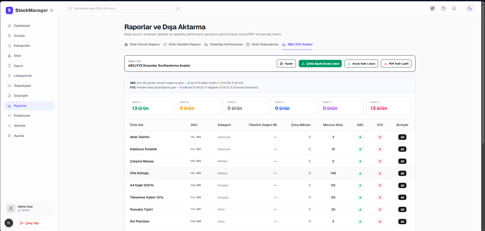
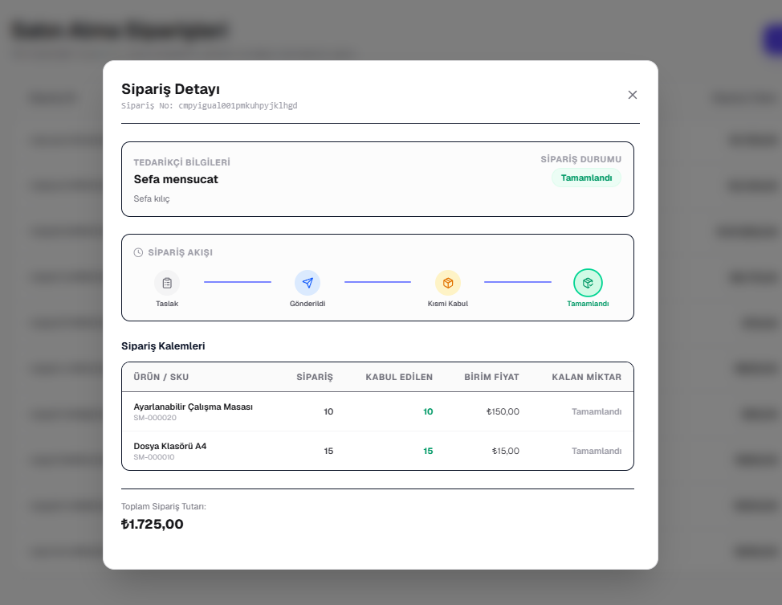

<div align="center">

# 📦 StockManager

### Production-Grade Warehouse Management System

A full-stack WMS built with modern TypeScript tooling — real-time inventory tracking, purchase order workflows, advanced analytics, and a fully customizable dashboard.

[](https://www.typescriptlang.org/)
[](https://nextjs.org/)
[](https://trpc.io/)
[](https://www.prisma.io/)
[](https://www.postgresql.org/)
[](https://tailwindcss.com/)

</div>

---

## 📸 Screenshots

> Dark mode • Seed data loaded

| Dashboard | Stock Grid |
|-----------|------------|
|  |  |

| ABC/XYZ Analysis | Order Timeline |
|-----------------|----------------|
|  |  |

---

## ✨ Features

### Core Modules
- **Authentication & RBAC** — NextAuth v5, bcryptjs password hashing, 4 role levels (`SUPER_ADMIN`, `WAREHOUSE_MANAGER`, `STAFF`, `VIEWER`), middleware-based route protection
- **Product Catalog** — Auto-generated SKU (`SM-000001`), barcode uniqueness validation, hierarchical categories, QR code generation, product image support
- **Multi-Location Inventory** — Zone / aisle / shelf / bin level tracking, reserved quantity management, real-time cross-tab sync via BroadcastChannel API
- **Stock Movements** — IN / OUT / TRANSFER / ADJUSTMENT types, per-movement reason logging, full movement history with filters
- **Low Stock Alerts** — BullMQ job queue + Redis, threshold-based triggers, Resend email delivery
- **Supplier & Purchase Orders** — Supplier rating system, full order workflow (`DRAFT → SENT → PARTIAL → RECEIVED → CANCELLED`), barcode-assisted receiving, visual status timeline
- **Excel / CSV Import-Export** — Row-level error reporting, template download, bulk stock movement upload, PDF report generation

### Analytics & Reporting
- **KPI Dashboard** — Total products, stock value, pending orders, critical stock count
- **Customizable Dashboard** — Drag & drop widget reordering, per-user layout persisted to DB (works across devices)
- **ABC/XYZ Inventory Classification** — 9-class matrix (AX → CZ), automatic reorder recommendations, demand variability scoring
- **Charts** — Stock movement trends, category distribution, location occupancy (Recharts)

### Developer-Facing
- **Email Template System** — 4 React Email templates (`LowStockAlert`, `WeeklyReport`, `OrderCreated`, `WelcomeEmail`), DB-configurable accent color / sender name / footer, admin management page
- **Audit Logging** — Full action trail (CREATE / UPDATE / DELETE / ADJUSTMENT) per user, filterable by date, user and action type
- **Live Activity Feed** — Timeline view with 10s polling, new-entry pulse animation, table/feed toggle
- **Barcode Scan Mode** — Topbar scan button, hardware barcode reader support (rapid keystroke + Enter detection)
- **Empty State Illustrations** — Custom SVG illustrations for all empty states (products, stock, orders, activity, search)

---

## 🏗️ Architecture

```
StockManager/
├── apps/
│   └── web/                        # Next.js 16 (App Router)
│       ├── src/
│       │   ├── app/
│       │   │   └── (dashboard)/    # Route group — all dashboard pages
│       │   ├── components/
│       │   │   ├── features/       # Domain-specific components
│       │   │   └── ui/             # Reusable UI primitives
│       │   ├── server/
│       │   │   └── routers/        # 11 tRPC routers
│       │   ├── lib/                # Pure utility functions (testable)
│       │   ├── hooks/              # Custom React hooks
│       │   └── __tests__/          # Unit tests
│       └── prisma/
│           ├── schema.prisma
│           ├── migrations/
│           └── seed.ts
└── packages/
    └── db/                         # Shared Prisma client
```

### Layered Architecture

| Layer | Technology | Responsibility |
|-------|-----------|----------------|
| **Presentation** | Next.js App Router + React 19 | Routing, rendering, layout, theming |
| **API / BFF** | tRPC v11 + Zod | Type-safe RPC, input validation, middleware |
| **Business Logic** | tRPC Procedures + BullMQ | Rules, queued jobs, notifications |
| **Data** | Prisma 7 + PostgreSQL | Schema, migrations, relations, queries |

---

## 🛠️ Tech Stack

**Frontend**

| | | | |
|---|---|---|---|
| Next.js 16 | React 19 | TypeScript 5 | Tailwind CSS 4 |
| tRPC v11 | TanStack Query | React Hook Form | Zod |
| Recharts | @dnd-kit | Lucide React | React Email |

**Backend & Infrastructure**

| | | | |
|---|---|---|---|
| PostgreSQL | Prisma 7 | NextAuth 5 | BullMQ |
| Redis / IORedis | Socket.io 4 | Resend | ExcelJS |
| jsPDF | bcryptjs | Sharp | QRCode |

**Tooling**

| | | | |
|---|---|---|---|
| Jest 30 | ts-jest | Playwright | ESLint 9 |
| pnpm | Turborepo | Prisma Migrate | Docker |

---

## 🚀 Getting Started

### Prerequisites

- Node.js 20+
- pnpm 9+
- Docker (for PostgreSQL + Redis)

### 1. Clone

```bash
git clone https://github.com/kilicseyit/StockManager.git
cd StockManager
```

### 2. Install Dependencies

```bash
pnpm install
```

### 3. Environment Variables

```bash
cp apps/web/.env.example apps/web/.env
```

Fill in the required values (see `.env.example` for all keys):

```env
DATABASE_URL=postgresql://...
NEXTAUTH_SECRET=...
NEXTAUTH_URL=http://localhost:3000
REDIS_URL=redis://localhost:6379
RESEND_API_KEY=...
```

### 4. Start Infrastructure

```bash
docker-compose up -d
```

### 5. Database Setup

```bash
cd apps/web

# Run migrations
npx prisma migrate dev

# Seed with demo data
npx prisma db seed
```

### 6. Run

```bash
pnpm dev
```

Open [http://localhost:3000](http://localhost:3000)

**Demo credentials (after seed):**

| Role | Email | Password |
|------|-------|----------|
| Super Admin | admin@demo.com | admin123 |
| Manager | manager@demo.com | manager123 |
| Staff | staff@demo.com | staff123 |

---

## 🧪 Testing

```bash
cd apps/web

# Run all unit tests
pnpm test

# Watch mode
pnpm test --watch
```

**Test coverage:**

| File | Tests | What's covered |
|------|-------|----------------|
| `abcXyzAnalysis.test.ts` | 9 | ABC/XYZ classification algorithm, edge cases |
| `emailTemplates.test.tsx` | 35 | All 4 React Email templates, render & content |

**Testing principles:**
- Algorithm logic is extracted to pure functions in `src/lib/` before testing
- Email templates are rendered with `react-dom/server` and validated as HTML
- Each new feature ships with a corresponding test file

---

## 📊 Database Schema

Key models and their relationships:

```
User ──────────────── StockMovement
 │                         │
 └── Warehouse             ├── Product ── StockItem ── Location
      └── Location         │       └── Category         └── Warehouse
                           └── PurchaseOrder ── PurchaseOrderItem
                                    └── Supplier
```

Enums:
- `Role`: `SUPER_ADMIN | WAREHOUSE_MANAGER | STAFF | VIEWER`
- `MovementType`: `IN | OUT | TRANSFER | ADJUSTMENT`
- `OrderStatus`: `DRAFT | SENT | PARTIAL | RECEIVED | CANCELLED`

---

## 🔑 Key Technical Decisions

**Why tRPC instead of REST?**
End-to-end type safety without code generation. When a backend procedure changes, TypeScript immediately flags the frontend. Combined with Zod for input validation and Prisma for output types, there are no `any` types at the API boundary.

**Why BroadcastChannel for real-time?**
Stock movements need to reflect across browser tabs instantly. BroadcastChannel API achieves cross-tab sync without a WebSocket server, keeping infrastructure simple while delivering the real-time feel.

**Why pure functions for ABC/XYZ?**
The classification algorithm (`src/lib/abcXyzAnalysis.ts`) is completely decoupled from UI and database. This makes it unit-testable, independently maintainable, and reusable.

**Why DB-persisted dashboard layout?**
Using `localStorage` would tie the layout to a single device. Persisting per-user widget configuration in PostgreSQL means the same layout appears on any device.

---

## 📁 Notable Files

```
src/lib/abcXyzAnalysis.ts          # ABC/XYZ classification — pure function
src/lib/email-templates/           # React Email templates (4)
src/lib/email.ts                   # Email dispatcher
src/server/routers/analytics.ts    # KPIs, trends, ABC/XYZ
src/server/routers/inventory.ts    # Stock movements, history, stats
src/components/features/dashboard/ # Customizable dashboard widgets
src/components/ui/EmptyState.tsx   # SVG empty state illustrations
apps/web/prisma/schema.prisma      # Full data model
apps/web/prisma/seed.ts            # Demo data seed
```

---

## 📄 License

MIT © [kilicseyit](https://github.com/kilicseyit)

---

<div align="center">

Built with TypeScript • Next.js • tRPC • PostgreSQL

</div>
